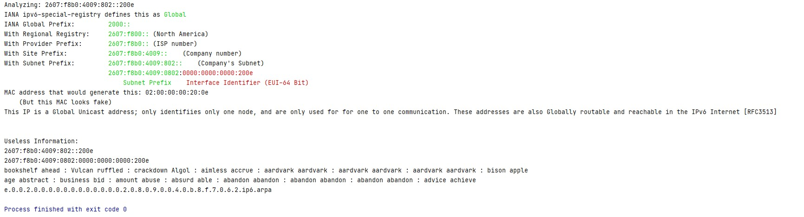

# IPv6_Analyzer

Feb 2022

## Description
This is a silly program to help me codify IPv6 knowledge.

##Features
- Tells you about the IPv6 address given
- Translates IPv6 addresses in GPG Keywords and Bitcoin seed words
- If a Unicast address is detected where we have a 64 bit EUI, this will display the would-be MAC address and org info

Sean Pierce [@secure_sean](https://twitter.com/secure_sean)